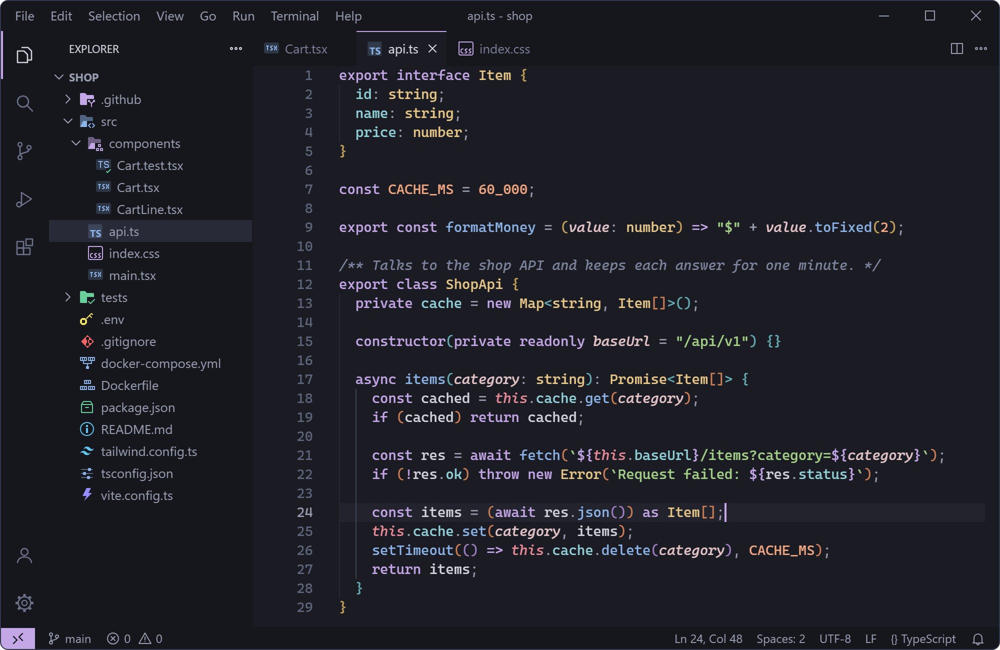
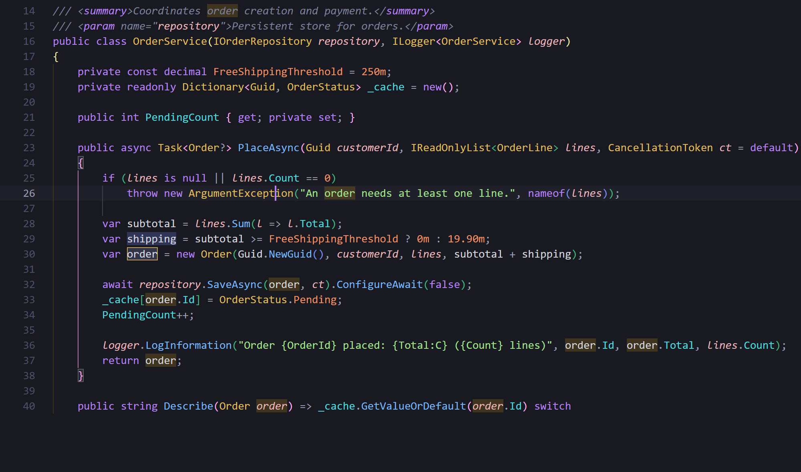
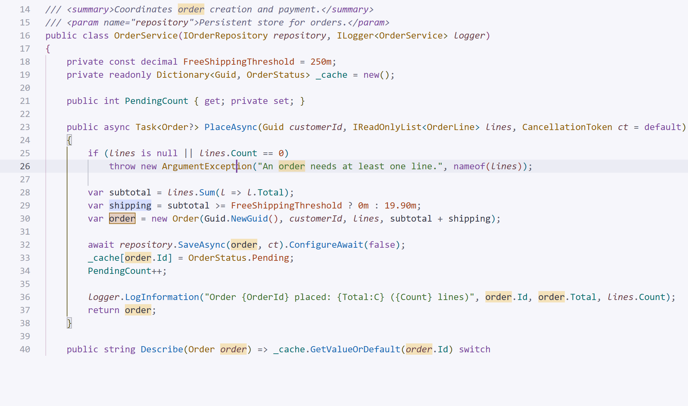
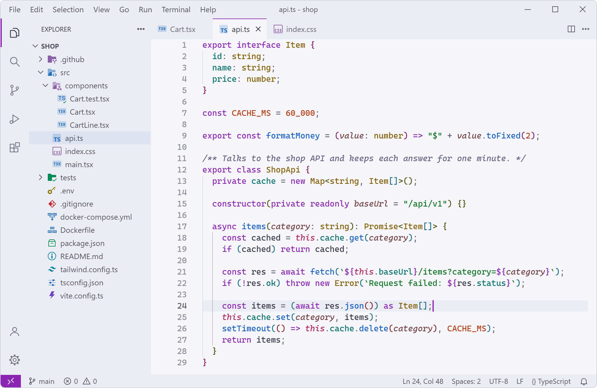
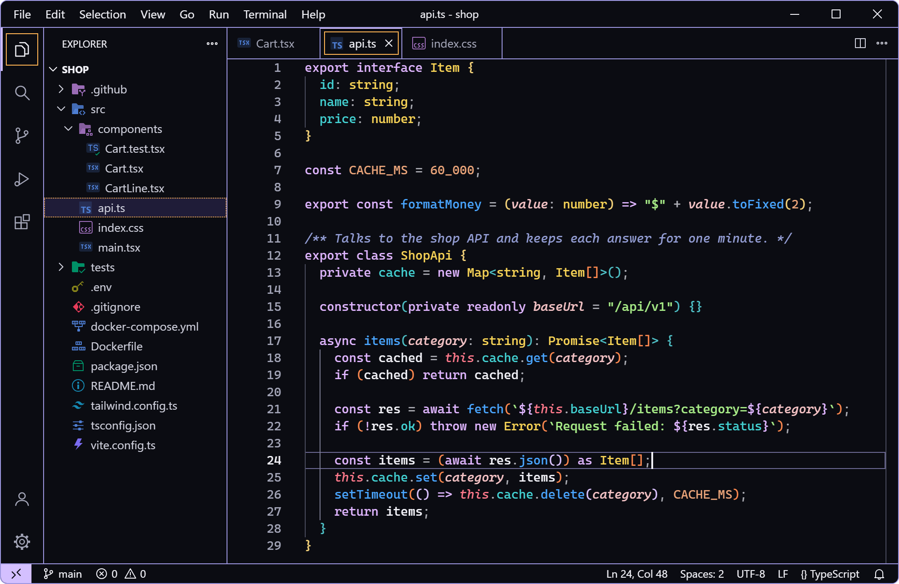
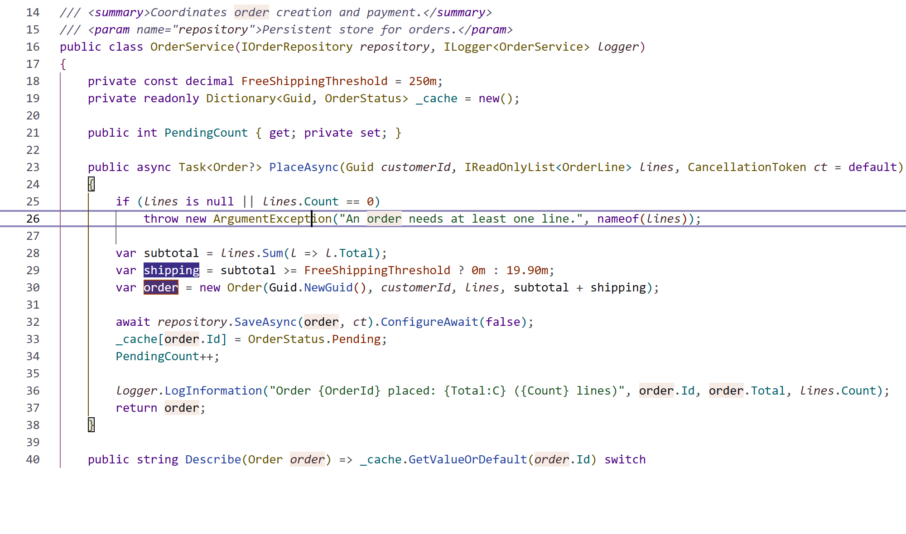
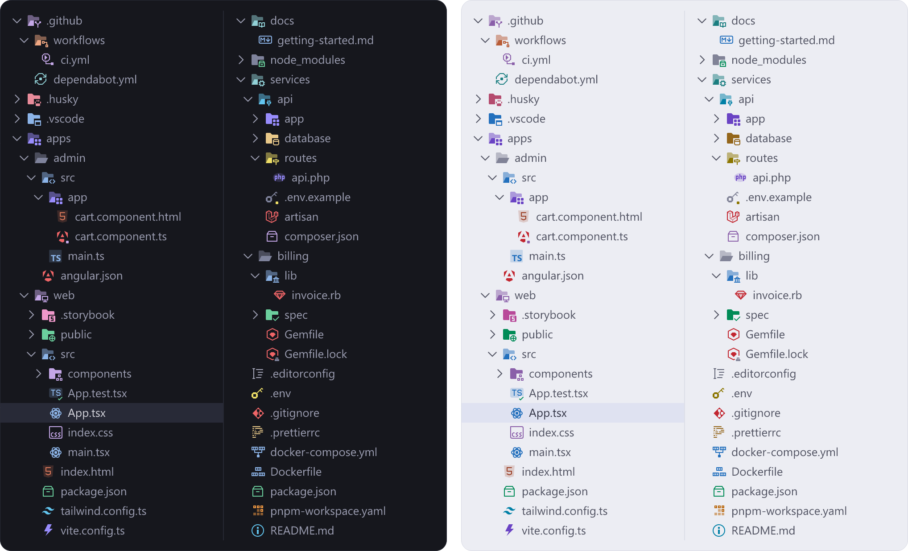
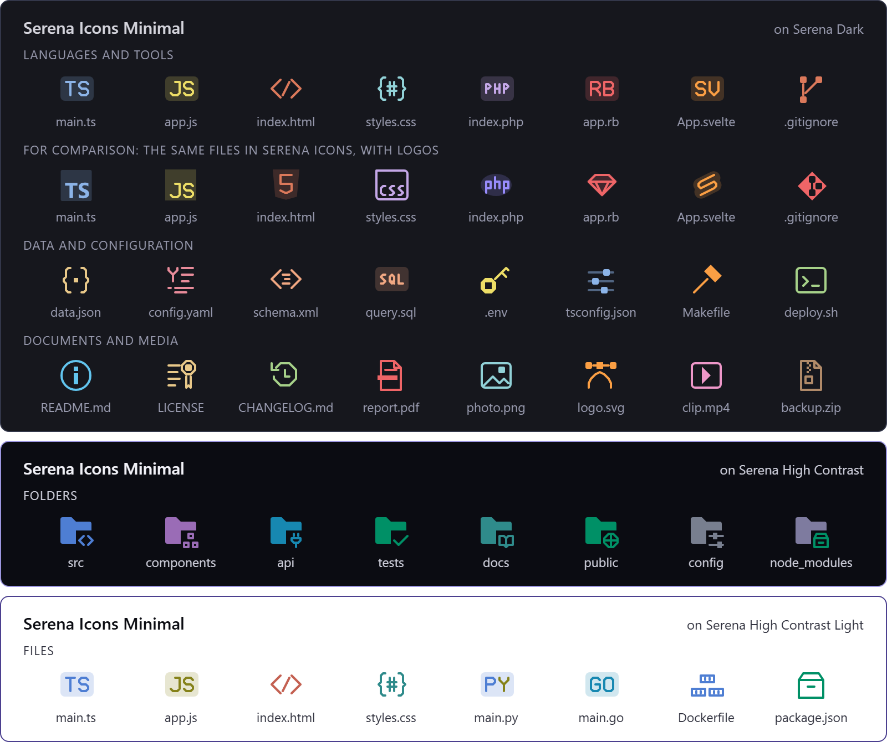

# Serena Theme

Calm, harmonious color themes for VS Code — **Serena Dark**, **Serena Dark Vivid**, **Serena Light**, **Serena Light Vivid**, **Serena High Contrast** and **Serena High Contrast Light** — plus **Serena Icons**, a matching file and folder icon theme in two editions. Each color has the same meaning in every variant, so you can switch between them without relearning anything.



## Color themes

| Theme | Best for |
|---|---|
| **Serena Dark** | Soft dark background with pastel tones, for long sessions. |
| **Serena Dark Vivid** | Same background, livelier and more energetic colors. |
| **Serena Light** | Light theme with a slightly cool background (no glaring pure white). |
| **Serena Light Vivid** | Same light background, more saturated colors. |
| **Serena High Contrast** | Near-black background, every syntax color at 7:1 or more (WCAG AAA), outlined panels and a strong focus ring — for low vision. |
| **Serena High Contrast Light** | White background with the same 7:1 rule and outlines. |











Every theme also styles the parts of VS Code people use every day: AI chat and inline suggestions, tests, notebooks, the merge editor, the terminal, the source control graph and the status bar.

## Serena Icons

Icons for **284 file types and 101 folders**, with separate versions for dark, light and high contrast themes. They work with any color theme. Two editions:

- **Serena Icons** — recognizable logos for 81 file types (JavaScript, TypeScript, React, Angular, Svelte, Nuxt, HTML, CSS, Tailwind, Git, PHP, Laravel, Ruby, Django, Jupyter, NuGet, Maven, CMake, Zig, Storybook, Cypress, Prettier, Yarn, pnpm, Bun, Deno, Markdown and more), redrawn in the Serena palette. Where a brand's guidelines don't allow recoloring or altering its logo (Python, Go, Docker, GitHub, Rust, Kotlin, Node, Claude…), an original icon that evokes it is used instead.
- **Serena Icons Minimal** — original artwork only: calm monograms and symbols, no third-party logos.





## Install and activate

1. Open the Extensions view (`Ctrl+Shift+X`), search for **Serena Theme** and select **Install**. From a terminal: `code --install-extension joaoangello.serena-theme`.
2. Color theme: `Ctrl+K Ctrl+T` (**Preferences: Color Theme**) and pick a Serena theme.
3. Icons: **Preferences: File Icon Theme** in the Command Palette, then **Serena Icons** or **Serena Icons Minimal**.

It also works in [vscode.dev](https://vscode.dev), and it is on [Open VSX](https://open-vsx.org/extension/joaoangello/serena-theme) for VSCodium, Cursor and other editors that use that registry.

## One meaning per color

| Color | Used for |
|---|---|
| Lavender | keywords, logical and comparison operators |
| Blue | functions and methods |
| Green | strings |
| Peach / orange | numbers, constants, enum members, attributes |
| Sand / ochre | types, classes, interfaces, components |
| Teal | properties, fields, JSON/YAML keys |
| Pink | HTML tags, `this` / `self` |
| Rose italic | parameters |

Syntax coverage was reviewed language by language, including semantic highlighting from the main language servers:

- **C#, Java, JavaScript, TypeScript, Go, Python, YAML** — in depth (Roslyn, Pylance, TypeScript classic and tsgo, gopls).
- **Rust, C, C++, Kotlin, Swift, Dart, Scala, Groovy, Zig, PHP, Ruby, Lua, R, Elixir, Perl, Bash, PowerShell, SQL, Vue, Svelte, Astro, Angular, Dockerfile, Makefile, TOML, INI, Terraform/HCL, GraphQL, XML, Markdown, CSS/SCSS/Less, HTML.**

## Recommended settings

Add these to your `settings.json` to get everything the theme offers:

```jsonc
{
  // Brackets colored by nesting level, with guides linking each pair
  "editor.bracketPairColorization.enabled": true,
  "editor.bracketPairColorization.independentColorPoolPerBracketType": false,
  "editor.guides.bracketPairs": true,
  "editor.guides.bracketPairsHorizontal": "active",
  "editor.guides.highlightActiveBracketPair": true,
  "editor.matchBrackets": "always",

  // HTML/JSX: editing the opening tag also edits the closing tag
  "editor.linkedEditing": true,

  // Go: semantic highlighting from gopls (types, packages, constants, parameters)
  "gopls": {
    "ui.semanticTokens": true,
    "ui.semanticTokenTypes": { "string": false, "operator": false }
  }
}
```

Bracket shortcuts: `Ctrl+Shift+\` jumps to the matching bracket; `Shift+Alt+Right` expands the selection to the next pair.

## Prefer no italics?

Serena uses italics for comments, parameters, `this`/`self`, attributes and decorators. To turn them off for all Serena themes:

<!-- no-italics:start -->
```jsonc
{
  "editor.tokenColorCustomizations": {
    "[Serena*]": {
      "textMateRules": [
        {
          "scope": [
            "comment", "punctuation.definition.comment", "string.comment",
            "variable.parameter",
            "variable.language.this", "variable.language.self", "variable.language.super", "variable.language.special.self", "variable.language.special.cls", "variable.parameter.function.language.special.self", "variable.parameter.function.language.special.cls",
            "entity.other.attribute-name",
            "entity.other.attribute-name.pseudo-class", "entity.other.attribute-name.pseudo-element",
            "punctuation.decorator", "punctuation.definition.decorator", "punctuation.definition.annotation",
            "entity.name.function.decorator", "meta.decorator meta.function-call entity.name.function", "storage.type.annotation",
            "markup.quote",
            "markup.italic",
            "entity.name.variable.parameter.cs", "variable.other.value.cs",
            "variable.language.this.cs", "variable.language.base.cs",
            "constant.other.key.java",
            "variable.language.arguments",
            "meta.function.decorator.python > support.type",
            "string.quoted.docstring", "string.quoted.docstring punctuation.definition.string",
            "meta.attribute.rust",
            "meta.macro.metavariable.rust keyword.operator.macro.dollar.rust", "variable.other.metavariable.name.rust",
            "support.other.attribute.cpp",
            "entity.name.type.annotation.kotlin", "entity.name.type.annotation-site.kotlin", "entity.name.function.annotation.kotlin",
            "storage.modifier.attribute.swift",
            "punctuation.definition.attribute.swift",
            "variable.language.swift",
            "variable.language.closure-parameter.swift",
            "variable.language.dart",
            "variable.language.scala",
            "variable.language.groovy",
            "constant.other.key.groovy",
            "variable.language.this.php punctuation.definition.variable.php",
            "meta.function.parameters.php variable.other.php", "meta.function.parameters.php variable.other.php punctuation.definition.variable.php",
            "entity.name.variable.parameter.php",
            "variable.other.readwrite.global.pre-defined.ruby", "variable.other.readwrite.global.pre-defined.ruby punctuation.definition.variable.ruby",
            "constant.other.symbol.hashkey.parameter.function.ruby",
            "variable.other.predefined.perl", "variable.other.predefined.perl punctuation.definition.variable.perl", "variable.other.readwrite.global.special.perl", "variable.other.readwrite.global.special.perl punctuation.definition.variable.perl", "variable.other.predefined.program-name.perl", "variable.other.predefined.program-name.perl punctuation.definition.variable.perl",
            "support.variable.automatic.powershell", "support.variable.automatic.powershell punctuation.definition.variable.powershell", "interpolated.complex.support.variable.automatic.powershell", "interpolated.complex.support.variable.automatic.powershell punctuation.definition.variable.powershell",
            "comment.line.double-dash.documentation.lua storage.type.annotation.lua", "storage.type.class.ldoc", "punctuation.definition.block.tag.ldoc",
            "variable.language.special.shell",
            "variable.language.makefile",
            "meta.at-rule.mixin.scss variable.scss", "meta.at-rule.function.scss variable.scss",
            "meta.directive.on.svelte entity.name.type.svelte", "meta.directive.bind.svelte entity.name.type.svelte", "meta.directive.bind.svelte variable.language.svelte", "meta.directive.let.svelte entity.name.type.svelte",
            "variable.other.readwrite.terraform",
            "meta.arguments.graphql variable.graphql",
            "entity.name.function.directive.graphql"
          ],
          "settings": { "fontStyle": "" }
        },
        {
          "scope": ["markup.bold markup.italic", "markup.italic markup.bold"],
          "settings": { "fontStyle": "bold" }
        }
      ]
    }
  },
  "editor.semanticTokenColorCustomizations": {
    "[Serena*]": {
      "rules": {
        "*": { "italic": false },
        "parameter": { "italic": false },
        "selfParameter": { "italic": false },
        "clsParameter": { "italic": false },
        "*.decorator:python": { "italic": false },
        "variable.decorator:python": { "italic": false },
        "regexComment": { "italic": false },
        "annotation": { "italic": false },
        "annotationMember": { "italic": false },
        "selfKeyword:rust": { "italic": false },
        "selfTypeKeyword:rust": { "italic": false },
        "attribute:rust": { "italic": false },
        "derive:rust": { "italic": false },
        "decorator:rust": { "italic": false },
        "decorator:kotlin": { "italic": false }
      }
    }
  }
}
```
<!-- no-italics:end -->

## Em português

Família de temas para o VS Code, harmônica e confortável: **Serena Dark** (escuro suave, tons pastel), **Serena Dark Vivid** (mesmo fundo, cores mais vivas), **Serena Light** (claro, sem o branco puro que ofusca) e **Serena Light Vivid** (claro, cores mais vivas), além de **Serena High Contrast** e **Serena High Contrast Light** (alto contraste: toda a sintaxe com 7:1 ou mais). Inclui o tema de ícones em duas edições: **Serena Icons** (com logos reconhecíveis redesenhados na paleta) e **Serena Icons Minimal** (só desenhos originais). Cada cor tem o mesmo significado em todas as variantes.

Para ativar: `Ctrl+K Ctrl+T` e escolha um tema Serena; para os ícones, **Preferences: File Icon Theme** e **Serena Icons** ou **Serena Icons Minimal**.

## Feedback

Found a token with the wrong color or a file without an icon? [Open an issue](https://github.com/joaooliveira10/serena-theme/issues) with the language and a small code sample.

## License

[MIT](LICENSE). The logo icons in **Serena Icons** are derived from third-party logos and keep their own licences and trademarks — see [THIRD_PARTY_NOTICES.md](THIRD_PARTY_NOTICES.md). All product names, logos and brands are property of their respective owners and are used for identification only.
