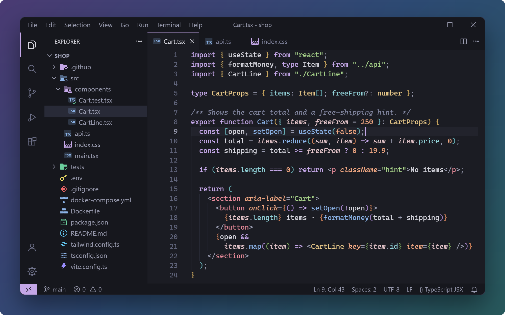
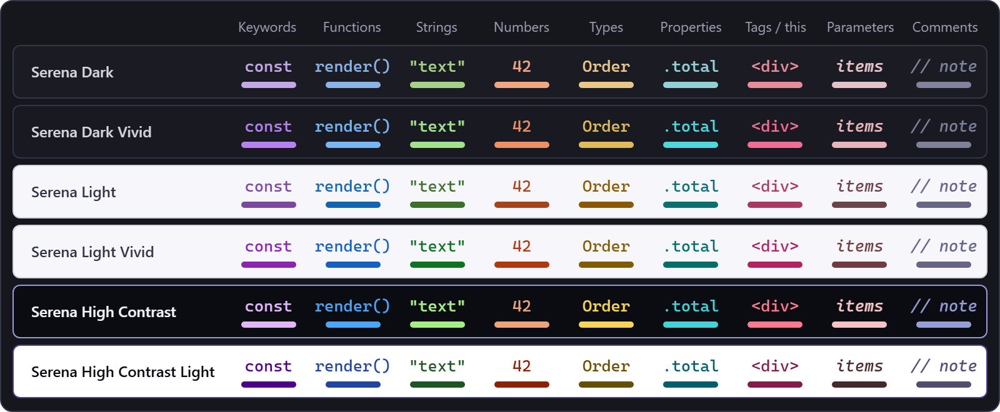

<p align="center">
  
</p>

<p align="center">
  <b>Serena: calm pastel themes for VS Code where every color keeps one meaning.</b><br>
  Six color themes (dark, light, vivid, high contrast) and two matching icon themes.
</p>

<p align="center">
  <a href="https://marketplace.visualstudio.com/items?itemName=joaoangello.serena-theme"></a>
  <a href="https://open-vsx.org/extension/joaoangello/serena-theme"></a>
  <a href="https://vscode.dev/theme/joaoangello.serena-theme/Serena%20Dark"></a>
</p>

<details>
<summary><b>Português</b>: leia a descrição em português</summary>

Família de temas para o VS Code, harmônica e confortável: **Serena Dark** (escuro suave, tons pastel), **Serena Dark Vivid** (fundo um pouco mais escuro, cores mais vivas), **Serena Light** (claro, sem o branco puro que ofusca) e **Serena Light Vivid** (mesmo fundo claro, cores mais vivas), além de **Serena High Contrast** e **Serena High Contrast Light** (alto contraste: toda a sintaxe com 7:1 ou mais no fundo do editor). Cada cor tem o mesmo significado em todas as variantes.

Inclui o tema de ícones em duas edições, com 284 ícones de arquivo e 101 de pasta, que reconhecem 1.013 extensões, 1.497 nomes de arquivo, 240 linguagens e 764 nomes de pasta: **Serena Icons** (com logos reconhecíveis redesenhados na paleta) e **Serena Icons Minimal** (só desenhos originais).

Para instalar: abra as extensões (`Ctrl+Shift+X`), procure `serena-theme` e clique em **Install** em **Serena — Calm Pastel Theme & Icons**, de João Angello. Para ativar: `Ctrl+K Ctrl+T` e escolha um tema Serena; para os ícones, **Preferences: File Icon Theme** e **Serena Icons** ou **Serena Icons Minimal**.

</details>

## Why Serena

Every Serena color has one job: keywords are purple, functions blue and strings green in all six themes, so switching between dark, light and high contrast never means relearning your code. Every syntax color is measured against the editor background, comments included: at least 4.5:1 in the four regular themes and at least 7:1 (WCAG AAA) in the two high contrast ones. The file and folder icons are drawn in the same palette, so the Explorer and the editor look like one product.



## Install

1. Open the Extensions view (`Ctrl+Shift+X`, macOS `⇧⌘X`), search for `serena-theme` and select **Install** on **Serena — Calm Pastel Theme & Icons** by João Angello. From a terminal: `code --install-extension joaoangello.serena-theme`.
2. Color theme: press `Ctrl+K Ctrl+T` (macOS `⌘K ⌘T`) and pick a Serena theme.
3. Icons: run **Preferences: File Icon Theme** from the Command Palette and pick **Serena Icons** or **Serena Icons Minimal**.

Serena is also on [Open VSX](https://open-vsx.org/extension/joaoangello/serena-theme) for VSCodium, Cursor and other editors that use that registry. To see it before installing, [open Serena Dark in vscode.dev](https://vscode.dev/theme/joaoangello.serena-theme/Serena%20Dark): it runs in the browser.

<details>
<summary><b>Follow the system</b>: switch between dark, light and high contrast automatically</summary>

Add this to your `settings.json`:

```jsonc
{
  "window.autoDetectColorScheme": true,
  "workbench.preferredDarkColorTheme": "Serena Dark",
  "workbench.preferredLightColorTheme": "Serena Light",
  "workbench.preferredHighContrastColorTheme": "Serena High Contrast",
  "workbench.preferredHighContrastLightColorTheme": "Serena High Contrast Light"
}
```

The two high contrast lines take effect when the operating system turns high contrast on (`window.autoDetectHighContrast`, enabled by default). Details are in the VS Code documentation: [Automatically switch based on OS color scheme](https://code.visualstudio.com/docs/configure/themes#_automatically-switch-based-on-os-color-scheme).

</details>

## Six themes

| Theme | Best for |
|---|---|
| **Serena&nbsp;Dark** | Soft dark background with pastel tones, for long sessions. |
| **Serena&nbsp;Dark&nbsp;Vivid** | A slightly darker background with more saturated colors. |
| **Serena&nbsp;Light** | A slightly cool off-white background, without the glare of pure white. |
| **Serena&nbsp;Light&nbsp;Vivid** | The same light background with more saturated colors. |
| **Serena&nbsp;High&nbsp;Contrast** | Near-black background for low vision. Every syntax color is at 7:1 or more (WCAG AAA) on the editor background; find, word and bracket highlights are drawn as outlines, so they do not lower it; panels are outlined and the focus ring is strong. |
| **Serena&nbsp;High&nbsp;Contrast&nbsp;Light** | White background with the same 7:1 rule and outlines. |

**Serena Light**


<details>
<summary><b>The other five themes</b></summary>

**Serena Dark**


**Serena Dark Vivid**


**Serena Light Vivid**


**Serena High Contrast**


**Serena High Contrast Light**


</details>

Every theme also styles the parts of VS Code used every day: AI chat and inline suggestions, tests, the debugger, the merge editor, the terminal, the source control graph and the status bar.

## Serena Icons

284 file icons and 101 folder icons, matched to 1,013 file extensions, 1,497 file names, 240 language modes and 764 folder names. Every icon is drawn for dark, light and high contrast themes, and the icon themes work with any color theme. Two editions:

- **Serena Icons**: recognizable logos for 68 file types and 8 folders (JavaScript, TypeScript, Angular, Svelte, Nuxt, HTML, CSS, Tailwind, Git, PHP, Laravel, Ruby, NuGet, CMake, Zig, Storybook, Prettier, Yarn, pnpm, Deno, Markdown and more), redrawn in the Serena palette. Where a brand's rules forbid recoloring or altering its logo, or require permission (Python, Go, Docker, GitHub, Rust, Kotlin, Node.js, React and others), the file type gets an original icon instead.
- **Serena Icons Minimal**: original artwork only. Monograms and symbols, no third-party logos.


<details>
<summary><b>Serena Icons Minimal</b>: the edition without logos</summary>


</details>

## One meaning per color

| Color | Used for |
|---|---|
| Lavender / purple | keywords, logical and comparison operators (grey in C#, Rust, Swift and a few other languages, where the grammar or the language server reports every operator the same way) |
| Blue | functions and methods |
| Green | strings |
| Peach / orange | numbers, constants, enum members, attributes |
| Sand / ochre | types, classes, interfaces, components |
| Teal | properties, fields, JSON/YAML keys |
| Pink | HTML tags, `this` / `self` (in C#, Dart and Scala, `this` / `base` / `super` are lavender italic and `true` / `false` / `null` are lavender: their language servers report them as keywords) |
| Rose italic | parameters |

Syntax was reviewed language by language, including semantic highlighting from the main language servers:

- **In depth:** C#, Java, JavaScript, TypeScript, Go, Python and YAML (Roslyn, Pylance, TypeScript classic and tsgo, gopls).
- **Also covered:** Rust, C, C++, Kotlin, Swift, Dart, Scala, Groovy, Zig, PHP, Ruby, Lua, R, Elixir, Perl, Bash, PowerShell, SQL, Vue, Svelte, Astro, Angular, Dockerfile, Makefile, TOML, INI, Terraform/HCL, GraphQL, XML, Markdown, CSS/SCSS/Less and HTML, plus `.env`, diff and log files.

## Settings

<details>
<summary><b>Recommended settings</b>: bracket colors, linked editing and Go semantic highlighting</summary>

Add these to your `settings.json` to get everything the themes offer:

```jsonc
{
  // Brackets colored by nesting level, with guides linking each pair
  "editor.bracketPairColorization.enabled": true,
  "editor.bracketPairColorization.independentColorPoolPerBracketType": false,
  "editor.guides.bracketPairs": true,
  "editor.guides.bracketPairsHorizontal": "active",
  "editor.guides.highlightActiveBracketPair": true,
  "editor.matchBrackets": "always",

  // HTML/JSX: editing the opening tag also edits the closing tag
  "editor.linkedEditing": true,

  // Go: semantic highlighting from gopls (types, packages, constants, parameters)
  "gopls": {
    "ui.semanticTokens": true,
    "ui.semanticTokenTypes": { "string": false, "operator": false }
  }
}
```

Bracket shortcuts: `Ctrl+Shift+\` (macOS `⇧⌘\`) jumps to the matching bracket; `Shift+Alt+Right` (macOS `⌃⇧⌘→`) expands the selection.

</details>

<details>
<summary><b>Prefer no italics?</b> Settings that turn them off in every Serena theme</summary>

Serena uses italics for comments, parameters, `this`/`self`, attributes and decorators. To turn them off in all Serena themes, add this to your `settings.json`:

<!-- no-italics:start -->
```jsonc
{
  "editor.tokenColorCustomizations": {
    "[Serena*]": {
      "textMateRules": [
        {
          "scope": [
            "comment", "punctuation.definition.comment", "string.comment",
            "variable.parameter",
            "variable.language.this", "variable.language.self", "variable.language.super", "variable.language.special.self", "variable.language.special.cls", "variable.parameter.function.language.special.self", "variable.parameter.function.language.special.cls", "variable.language.java",
            "entity.other.attribute-name",
            "entity.other.attribute-name.pseudo-class", "entity.other.attribute-name.pseudo-element",
            "punctuation.decorator", "punctuation.definition.decorator", "punctuation.definition.annotation",
            "entity.name.function.decorator", "meta.decorator meta.function-call entity.name.function", "storage.type.annotation",
            "markup.quote",
            "markup.italic",
            "entity.name.variable.parameter.cs", "variable.other.value.cs",
            "variable.language.this.cs", "variable.language.base.cs",
            "constant.other.key.java",
            "variable.language.arguments",
            "meta.function.decorator.python > support.type",
            "string.quoted.docstring", "string.quoted.docstring punctuation.definition.string",
            "meta.attribute.rust",
            "meta.macro.metavariable.rust keyword.operator.macro.dollar.rust", "variable.other.metavariable.name.rust",
            "support.other.attribute.cpp",
            "entity.name.type.annotation.kotlin", "entity.name.type.annotation-site.kotlin", "entity.name.function.annotation.kotlin",
            "storage.modifier.attribute.swift",
            "punctuation.definition.attribute.swift",
            "variable.language.swift",
            "variable.language.closure-parameter.swift",
            "variable.language.dart",
            "variable.language.scala",
            "variable.language.groovy",
            "constant.other.key.groovy",
            "variable.language.this.php punctuation.definition.variable.php",
            "meta.function.parameters.php variable.other.php", "meta.function.parameters.php variable.other.php punctuation.definition.variable.php",
            "entity.name.variable.parameter.php",
            "variable.other.readwrite.global.pre-defined.ruby", "variable.other.readwrite.global.pre-defined.ruby punctuation.definition.variable.ruby",
            "constant.other.symbol.hashkey.parameter.function.ruby",
            "variable.other.predefined.perl", "variable.other.predefined.perl punctuation.definition.variable.perl", "variable.other.readwrite.global.special.perl", "variable.other.readwrite.global.special.perl punctuation.definition.variable.perl", "variable.other.predefined.program-name.perl", "variable.other.predefined.program-name.perl punctuation.definition.variable.perl",
            "support.variable.automatic.powershell", "support.variable.automatic.powershell punctuation.definition.variable.powershell", "interpolated.complex.support.variable.automatic.powershell", "interpolated.complex.support.variable.automatic.powershell punctuation.definition.variable.powershell",
            "comment.line.double-dash.documentation.lua storage.type.annotation.lua", "storage.type.class.ldoc", "punctuation.definition.block.tag.ldoc",
            "variable.language.special.shell",
            "variable.language.makefile",
            "meta.at-rule.mixin.scss variable.scss", "meta.at-rule.function.scss variable.scss",
            "meta.directive.on.svelte entity.name.type.svelte", "meta.directive.bind.svelte entity.name.type.svelte", "meta.directive.bind.svelte variable.language.svelte", "meta.directive.let.svelte entity.name.type.svelte",
            "variable.other.readwrite.terraform",
            "meta.arguments.graphql variable.graphql",
            "entity.name.function.directive.graphql"
          ],
          "settings": { "fontStyle": "" }
        },
        {
          "scope": ["markup.bold markup.italic", "markup.italic markup.bold"],
          "settings": { "fontStyle": "bold" }
        }
      ]
    }
  },
  "editor.semanticTokenColorCustomizations": {
    "[Serena*]": {
      "rules": {
        "*": { "italic": false },
        "parameter": { "italic": false },
        "selfParameter": { "italic": false },
        "clsParameter": { "italic": false },
        "*.decorator:python": { "italic": false },
        "variable.decorator:python": { "italic": false },
        "regexComment": { "italic": false },
        "annotation": { "italic": false },
        "annotationMember": { "italic": false },
        "selfKeyword:rust": { "italic": false },
        "selfTypeKeyword:rust": { "italic": false },
        "attribute:rust": { "italic": false },
        "derive:rust": { "italic": false },
        "decorator:rust": { "italic": false },
        "decorator:kotlin": { "italic": false }
      }
    }
  }
}
```
<!-- no-italics:end -->

</details>

## Feedback

Found a token with the wrong color or a file without an icon? [Open an issue](https://github.com/joaooliveira10/serena-theme/issues) with the language and a small code sample. If Serena works for you, a rating on the [Marketplace](https://marketplace.visualstudio.com/items?itemName=joaoangello.serena-theme&ssr=false#review-details) or on [Open VSX](https://open-vsx.org/extension/joaoangello/serena-theme/reviews), or a star on [GitHub](https://github.com/joaooliveira10/serena-theme), helps other people find it. What changed in each version is in the [changelog](CHANGELOG.md).

## License

[MIT](LICENSE). The logo icons in **Serena Icons** are derived from third-party logos and keep their own licenses and trademarks: see [THIRD_PARTY_NOTICES.md](THIRD_PARTY_NOTICES.md). All product names, logos and brands are property of their respective owners and are used for identification only.

The images on this page are rendered from the theme and icon files of this repository. The editor font in them is Cascadia Code.
